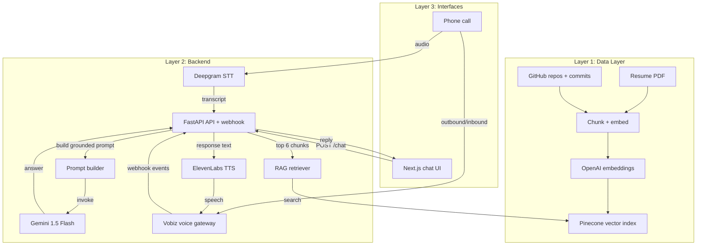

# AI Persona

A full-stack, production-oriented AI persona system that combines:
- a **Next.js + Tailwind** chat and booking frontend,
- a **FastAPI** backend with **RAG retrieval**,
- a **Gemini LLM** powered persona,
- **Pinecone** vector search over resume and GitHub data,
- and a **Vobiz voice workflow** for outbound phone calls.

This project is built to demonstrate a real AI-driven candidate experience: answer recruiter questions, summarize GitHub projects, and book interview slots using live calendar availability.

---

## Features

- **RAG-grounded chat** using a resume and GitHub repo dataset
- **Voice call integration** via Vobiz for recruiter outreach
- **Live booking workflow** using calendar availability data
- **Chat UI with quick actions** and resume download support
- **Embeddings + semantic search** with OpenAI & Pinecone
- **Eval suite** to verify persona quality and retrieval accuracy

---

## Architecture

This project is organized into three clear layers:

- **Layer 1: Data layer** — resume PDF + public GitHub repos are fetched, chunked, embedded with **OpenAI text-embedding-3-small**, and persisted in **Pinecone**.
- **Layer 2: Backend** — **FastAPI** on Railway handles chat requests and Vobiz voice webhook events. Each query retrieves the top 6 Pinecone chunks, builds a grounded prompt, and sends it to **Gemini 1.5 Flash**. Gemini is constrained to answer only from retrieved context.
- **Layer 3: Interfaces** — chat runs in **Next.js** on Vercel, and voice runs through **Vobiz** with **Deepgram** STT and **ElevenLabs** TTS.



### Quick monitoring path

**Railway logs → Pinecone index → Vercel**

This is the fastest path to verify the backend behavior, retrieval health, and frontend connectivity.

---

## Tech Stack

| Layer | Technology | Purpose |
|---|---|---|
| Frontend | Next.js 14, React, Tailwind CSS | User chat/book interface |
| Backend | FastAPI, Uvicorn | REST API, voice and booking flow |
| LLM | Gemini 1.5 Flash | Persona response generation |
| Embeddings | OpenAI text-embedding-3-small | Semantic search vectors |
| Vector DB | Pinecone | RAG retrieval store |
| Voice | Vobiz | Outbound phone call voice orchestration |
| Data | PyMuPDF, GitHub JSON | Resume + repo knowledge source |
| Evaluation | Custom evals | Response quality and correctness |

---

## Repository Structure

- `backend/` — FastAPI application, RAG ingestion, voice handlers, booking logic, eval suite
- `backend/rag/` — Retriever, prompt builder, ingest pipeline
- `backend/data/` — Resume and GitHub metadata
- `backend/evals/` — Evaluation runner, report generator
- `backend/voice/` — Calendar tooling and Vobiz voice flow
- `frontend/` — Next.js app, chat UI, booking widget, API proxy

---

## Getting Started

### Prerequisites

- Python 3.11+
- Node.js 18+
- `npm`
- Accounts / keys for:
  - Gemini AI Studio
  - OpenAI
  - Pinecone
  - Vobiz
  - Cal.com (optional booking)

### 1. Clone the repository

```bash
git clone https://github.com/yourusername/ai-persona.git
cd ai-persona
```

### 2. Install backend dependencies

```bash
cd backend
python -m pip install -r requirements.txt
```

### 3. Install frontend dependencies

```bash
cd ../frontend
npm install
```

### 4. Configure environment variables

Create a `.env` file at the project root or in `backend/` with the following keys:

```env
GEMINI_API_KEY=your_gemini_api_key
OPENAI_API_KEY=your_openai_api_key
PINECONE_API_KEY=your_pinecone_api_key
PINECONE_INDEX_NAME=ai-persona

VOBIZ_AUTH_ID=your_vobiz_auth_id
VOBIZ_AUTH_TOKEN=your_vobiz_auth_token
VOBIZ_CALLER_ID=your_vobiz_caller_id
PUBLIC_BACKEND_URL=https://your-backend.example.com

# Optional / local
BACKEND_URL=http://localhost:8000
NEXT_PUBLIC_BACKEND_URL=http://localhost:8000
```

> `config.py` loads `.env` from the repo root and `backend/`, so either location works.

### 5. Add your resume and GitHub data

- Place a candidate resume at `backend/data/resume.pdf`
- Populate `backend/data/github_repos.json` using the fetch script

```bash
cd backend
python ../scripts/fetch_github.py
```

### 6. Ingest the knowledge base

```bash
cd backend
python rag/ingest.py
```

This will embed the resume and GitHub repo data into Pinecone under namespace `persona`.

### 7. Run the backend

```bash
cd backend
uvicorn main:app --reload --host 0.0.0.0 --port 8000
```

Backend endpoints include:
- `POST /chat`
- `GET /health`
- `GET /github/repos`
- `GET /voice/config`
- `POST /voice/call`
- `POST /vobiz/answer`
- `POST /vobiz/respond`
- `POST /vobiz/status`
- `POST /vobiz/fallback`

### 8. Run the frontend

```bash
cd frontend
npm run dev
```

Open `http://localhost:3000` and verify the app can reach the backend.

---

## Voice & Booking Notes

- Voice calling is handled by `backend/voice/vobiz_handler.py`
- The frontend uses `frontend/components/VoiceCallWidget.tsx`
- Booking flows use `backend/voice/calendar_tool.py`
- To enable voice, set Vobiz keys and `PUBLIC_BACKEND_URL`

---

## Evaluation

Run the built-in evaluation harness from `backend/evals/`:

```bash
cd backend
python evals/run_evals.py
```

Generate a report:

```bash
python evals/generate_report.py
```

---

## Deployment Guidance

- Backend: deploy the `backend/` folder as a container or Python service
- Frontend: deploy the `frontend/` folder to Vercel or another static host
- Set `NEXT_PUBLIC_BACKEND_URL` for the frontend production config
- Set `PUBLIC_BACKEND_URL` so Vobiz can resolve webhook callbacks

---

## Contribution

- Update the resume at `backend/data/resume.pdf`
- Keep `backend/data/github_repos.json` up to date with `scripts/fetch_github.py`
- Extend the RAG prompt in `backend/rag/prompt_builder.py`
- Add new conversation samples or eval cases in `backend/evals/`

---

## Contact

For questions or feature improvements, look at the backend API and the frontend chat flow, or open an issue in the repo.
